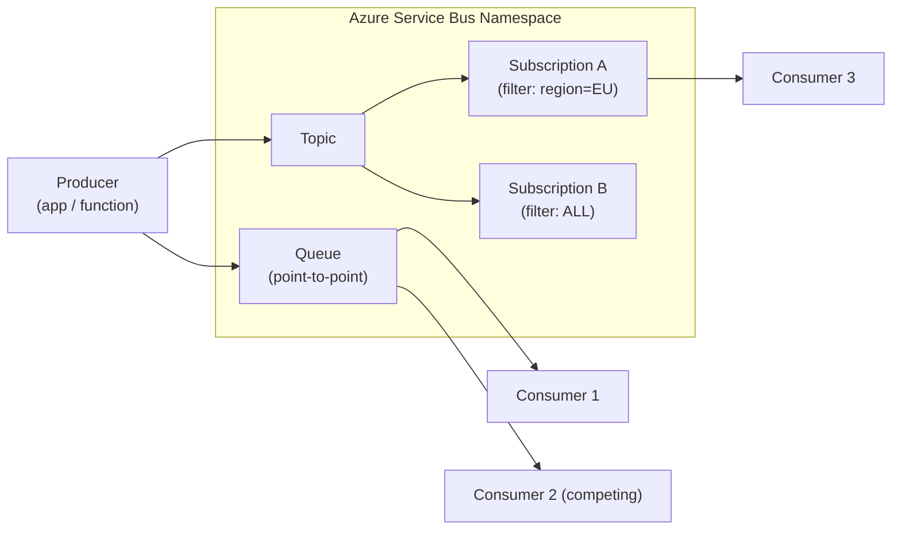
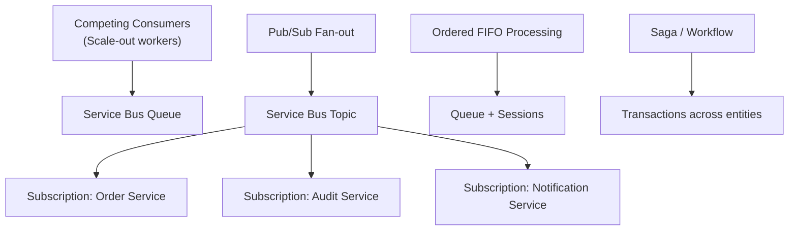

# 📨 Azure Service Bus
{: .no_toc }

**Enterprise-grade message broker with queues, topics, and full transactional support**
{: .fs-5 .fw-300 }

---

## Table of Contents
{: .no_toc .text-delta }

1. TOC
{:toc}

---

## Product Overview

Azure Service Bus is a **fully managed enterprise message broker** that decouples applications and services. It supports two core messaging patterns:

- **Queues** — point-to-point (one sender, one receiver), FIFO optional, competitive consumers
- **Topics + Subscriptions** — publish/subscribe, one message fanned out to multiple independent subscribers via filter rules

Service Bus is the correct choice when you need **guaranteed delivery, ordering, duplicate detection, dead-lettering, or transactions** — capabilities that Storage Queues do not offer.

---

## Core Concepts

### Namespace
The top-level container for all Service Bus entities (queues, topics, subscriptions). A namespace maps to a **fully qualified domain name** and is the unit of billing and access control.

### Queues

| Property | Detail |
|----------|--------|
| Delivery model | At-least-once; exactly-once via peek-lock + settlement |
| Message ordering | FIFO guaranteed only when using **Sessions** |
| Competing consumers | ✅ Multiple receivers can pull from the same queue |
| Max message size | **256 KB** (Standard) / **100 MB** (Premium, large message support) |
| Max queue size | 1 GB – 80 GB (configurable at creation) |
| Max message TTL | Configurable; default 14 days |
| Dead-letter queue | ✅ Automatic sub-queue for failed / expired messages |

### Topics & Subscriptions

| Property | Detail |
|----------|--------|
| Pattern | Publish/Subscribe (fan-out) |
| Max subscriptions per topic | 2,000 |
| Subscription filters | SQL-like filter rules, correlation filters, Boolean |
| Independent delivery | Each subscription receives its own copy of matching messages |
| Dead-letter queue | Each subscription has its own DLQ |

### Sessions
Sessions enable **first-in, first-out (FIFO) ordering** for related messages by grouping them under a `SessionId`. Only one consumer holds a session lock at a time — this is the exam-critical mechanism for ordered processing.

> ⚠️ **Exam Caveat:** Sessions are required for guaranteed ordering. A queue alone does NOT guarantee FIFO. Sessions are available on both Standard and Premium, but at-scale session handling benefits from Premium.

### Dead-Letter Queue (DLQ)
Every queue and subscription has an automatic **sub-queue** (`$DeadLetterQueue`) that receives messages when:
- Max delivery count is exceeded
- Message TTL expires (if `DeadLetteringOnMessageExpiration` is enabled)
- Subscription filter evaluation fails
- Application explicitly dead-letters a message

### Duplicate Detection
When enabled, Service Bus stores a hash of `MessageId` for a configurable **history window** (default 10 min, max 7 days) and silently discards duplicate sends.

> ⚠️ **Exam Caveat:** Duplicate detection history window must be set at entity creation and cannot be changed on an existing entity.

---

## SKU Tiers

| Feature | Basic | Standard | Premium |
|---------|-------|----------|---------|
| **Price model** | Per operation | Per operation | Fixed hourly (Messaging Units) |
| **Queues** | ✅ | ✅ | ✅ |
| **Topics & Subscriptions** | ❌ | ✅ | ✅ |
| **Sessions (FIFO)** | ❌ | ✅ | ✅ |
| **Duplicate detection** | ❌ | ✅ | ✅ |
| **Dead-letter queue** | ✅ (queues only) | ✅ | ✅ |
| **Scheduled messages** | ❌ | ✅ | ✅ |
| **Transactions** | ❌ | ✅ | ✅ |
| **Max message size** | 256 KB | 256 KB | **100 MB** |
| **VNet Service Endpoints** | ❌ | ❌ | ✅ |
| **Private Endpoints** | ❌ | ❌ | ✅ |
| **Geo-Disaster Recovery** | ❌ | ❌ | ✅ |
| **Availability Zones** | ❌ | ❌ | ✅ |
| **Dedicated resources** | ❌ | ❌ | ✅ (Messaging Units) |
| **Customer-managed keys** | ❌ | ❌ | ✅ |

> ⚠️ **Exam Caveat — Most Tested SKU Gaps:**
> - Topics require **Standard or Premium** (Basic has queues only)
> - VNet integration and Private Endpoints require **Premium**
> - Geo-DR requires **Premium**
> - Large messages (>256 KB) require **Premium**

---

## Messaging Units (Premium)

Premium namespaces are provisioned in **Messaging Units (MUs)** — dedicated compute and memory. MUs can be scaled up/down without downtime.

| MUs | Relative Throughput |
|-----|---------------------|
| 1 MU | Baseline |
| 2 MU | ~2× |
| 4 MU | ~4× |
| 8 MU | ~8× |
| 16 MU | ~16× |

**Auto-scaling** is available via Azure Monitor autoscale rules on the namespace.

---

## SLA

| SKU | Uptime SLA |
|-----|-----------|
| Basic | **99.9%** |
| Standard | **99.9%** |
| Premium | **99.9%** (single AZ) / **99.99%** (with Availability Zones) |

> ⚠️ **Exam Caveat:** The SLA uplift to **99.99%** on Premium requires Availability Zones to be **enabled at namespace creation** — it cannot be added after the fact.

---

## Security

| Mechanism | Notes |
|-----------|-------|
| **Shared Access Signatures (SAS)** | Default auth; namespace or entity-level keys |
| **Microsoft Entra ID (RBAC)** | Preferred for managed identities and applications |
| **Managed Identity** | Assign `Azure Service Bus Data Sender/Receiver` roles |
| **Private Endpoints** | Premium only; keeps traffic on VNet backbone |
| **Customer-managed keys (CMK)** | Premium only; bring-your-own key via Azure Key Vault |
| **TLS in transit** | TLS 1.2+ enforced |

### Built-in RBAC Roles

| Role | Permissions |
|------|-------------|
| `Azure Service Bus Data Owner` | Full control |
| `Azure Service Bus Data Sender` | Send messages |
| `Azure Service Bus Data Receiver` | Receive/peek messages |

---

## Advanced Features

### Scheduled Messages
Messages can be enqueued with a future delivery time using `ScheduledEnqueueTimeUtc`. Useful for delayed processing without external schedulers.

### Message Deferral
A consumer can **defer** a message (remove from active queue, keep by sequence number) and retrieve it later. Unlike DLQ, deferred messages stay in the main queue.

### Transactions
Service Bus supports **atomic transactions** across operations within the same namespace:
- Send to multiple queues/topics
- Receive + send (atomic transfer)
- Up to 100 operations per transaction

> ⚠️ **Exam Caveat:** Transactions are scoped to a **single namespace** — you cannot atomically write across two different Service Bus namespaces.

### Geo-Disaster Recovery (Geo-DR)
Premium only. Pairs a **primary** and **secondary** namespace in different regions. Metadata (queues, topics, subscriptions) replicates asynchronously. On failover, the secondary namespace's FQDN alias takes over.

> ⚠️ **Exam Caveat:** Geo-DR replicates **metadata only** — messages in flight on the primary are NOT replicated. For message-level replication, use **Active Replication** pattern at the application layer or **Event Hubs Geo-DR** (which has the same caveat).

### Message Lock (Peek-Lock)
The default receive mode. The broker locks the message for a configurable lock duration (max 5 minutes). The consumer must either `Complete` (delete), `Abandon` (re-enqueue), `DeadLetter`, or `Defer` before the lock expires.

---

## Integration Patterns

---

## Common Exam Scenarios

| Scenario | Answer |
|----------|--------|
| Guaranteed FIFO message ordering | Service Bus Queue **with Sessions** |
| Fan-out to multiple independent consumers | Service Bus **Topic + Subscriptions** |
| Atomic send across multiple queues | Service Bus **Transactions** (same namespace) |
| Message larger than 256 KB | Service Bus **Premium** |
| Isolate Service Bus from public internet | Service Bus Premium + **Private Endpoint** |
| Replay messages after consumer failure | Service Bus does **not** support replay — use Event Hubs |
| Dead-letter failed messages automatically | Service Bus **Dead-Letter Queue** |
| Duplicate sends must be silently dropped | Service Bus **Duplicate Detection** |

---

[← Back to Home](/az-305-messaging/) | [02 — Azure Storage Queues →](/az-305-messaging/02-storage-queues/)
