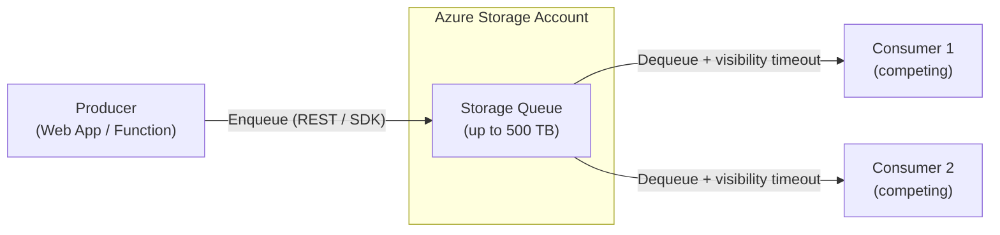

# 📦 Azure Storage Queues
{: .no_toc }

**Simple, massively scalable queue storage for decoupled workloads — at minimal cost**
{: .fs-5 .fw-300 }

---

## Table of Contents
{: .no_toc .text-delta }

1. TOC
{:toc}

---

## Product Overview

Azure Storage Queues are a **queue service built on top of Azure Blob Storage accounts**. They provide a simple REST-accessible message queue for asynchronous communication between application components. Storage Queues are the right choice when you need a **cheap, durable, simple queue** and do not require enterprise messaging features like ordering, transactions, dead-lettering, or topics.

Storage Queues are part of the **Azure Storage account** — the same account that hosts Blob containers, File shares, and Tables — meaning there is no separate resource to provision.

---

## Core Concepts

### Queue
A Storage Queue is a flat list of messages stored in a storage account. A single storage account can hold **up to 500 TB of queue data** across an unlimited number of queues.

### Message

| Property | Detail |
|----------|--------|
| Format | UTF-8 text (often Base64-encoded binary) |
| Max message size | **64 KB** |
| Max TTL | **7 days** (default); configurable 1 second – 7 days (or infinite with `-1`) |
| Delivery model | **At-least-once** (no exactly-once without application logic) |
| Ordering | **Best-effort FIFO** — NOT guaranteed |

> ⚠️ **Exam Caveat:** Storage Queues guarantee **at-least-once** delivery, NOT exactly-once. Message ordering is approximate. If your scenario requires guaranteed FIFO or exactly-once, use **Service Bus with Sessions**.

### Visibility Timeout
When a consumer dequeues a message, it becomes **invisible** to other consumers for the duration of the **visibility timeout** (default 30 seconds, max 7 days). If the consumer does not delete the message before the timeout expires, the message becomes visible again and can be picked up by another consumer — this enables competing consumer patterns.

### Poison Message Handling
Storage Queues track a `DequeueCount` property. Applications must implement their own logic to detect and handle poison messages (e.g., move to a separate "dead-letter" queue after `DequeueCount > threshold`).

> ⚠️ **Exam Caveat:** Storage Queues have **no built-in dead-letter queue**. If the scenario mentions automatic DLQ handling, the answer is **Azure Service Bus**, not Storage Queues.

### Long Polling
Consumers can use **long polling** (up to 20 seconds wait) to reduce empty-response round trips and lower costs.

---

## Limits & Quotas

| Parameter | Limit |
|-----------|-------|
| Max message size | **64 KB** |
| Max message TTL | **7 days** |
| Max queue size | **500 TB** (storage account limit) |
| Max messages returned per batch dequeue | **32** |
| Visibility timeout range | 1 second – 7 days |
| Max storage account queues | Unlimited |
| Max throughput | ~2,000 transactions/second per queue (partition limits apply) |

---

## SLA

| Tier | Uptime SLA |
|------|-----------|
| Standard (LRS/GRS) | **99.9%** read + write |
| Standard (RA-GRS) | **99.99%** read (from secondary) / **99.9%** write |
| Premium (not available for queues) | N/A |

> ⚠️ **Exam Caveat:** Azure Storage Queues exist only in **Standard** storage accounts. There is no premium Queue Storage tier.

---

## Security

| Mechanism | Notes |
|-----------|-------|
| **Storage Account Keys** | Full access to all storage services in the account |
| **Shared Access Signatures (SAS)** | Scoped, time-limited tokens for queue operations |
| **Microsoft Entra ID (RBAC)** | Preferred; assign built-in roles |
| **Storage Firewall / VNet rules** | Restrict access to specific VNets / IPs |
| **Private Endpoints** | ✅ Available via `Microsoft.Storage/storageAccounts` private link |
| **Encryption at rest** | AES-256 by default; CMK supported via Key Vault |

### Built-in RBAC Roles

| Role | Permissions |
|------|-------------|
| `Storage Queue Data Contributor` | Read, write, delete queues and messages |
| `Storage Queue Data Reader` | Read queues and messages |
| `Storage Queue Data Message Sender` | Send messages to queues |
| `Storage Queue Data Message Processor` | Receive and delete messages |

---

## Integration

### Azure Functions Trigger
Storage Queues integrate natively with **Azure Functions** via the `QueueTrigger` binding. The runtime handles dequeue, visibility timeout renewal, and poison message detection (moves to `{queuename}-poison` after 5 failures by default).

### Azure Logic Apps
Logic Apps has a built-in Storage Queue connector for polling and sending messages.

### Azure Monitor Alerts
You can alert on `ApproximateMessageCount` to detect growing backlogs.

---

## When Storage Queues Beat Service Bus

| Requirement | Storage Queues | Service Bus |
|-------------|---------------|-------------|
| Need > 80 GB queue storage | ✅ (500 TB) | ❌ (max 80 GB) |
| Audit log of all messages needed | ✅ (via storage logging) | Limited |
| Lowest possible cost | ✅ | ❌ (more expensive) |
| Simple polling from legacy code | ✅ (plain REST) | REST/AMQP |
| No requirement for ordering/transactions | ✅ | Overkill |

---

## Common Exam Scenarios

| Scenario | Answer |
|----------|--------|
| Cheap simple queue, no ordering required | Azure **Storage Queues** |
| Queue must hold >80 GB of messages | Azure **Storage Queues** |
| Need dead-letter queue automatically | Azure **Service Bus** (not Storage Queues) |
| Need guaranteed FIFO ordering | Azure **Service Bus with Sessions** |
| Message > 64 KB | Azure **Service Bus** (Standard: 256 KB, Premium: 100 MB) |
| Transactions across queue operations | Azure **Service Bus** |
| Simple trigger for Azure Functions, lowest cost | Azure **Storage Queue trigger** |
