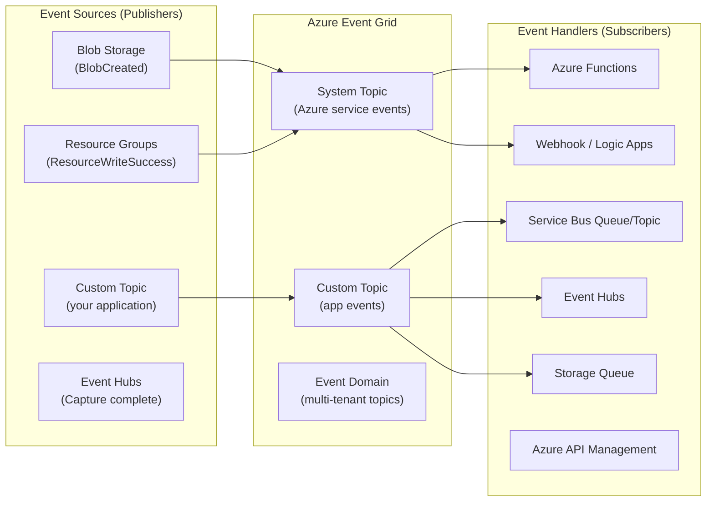

# ⚡ Azure Event Grid
{: .no_toc }

**Serverless event routing at scale — react to state changes across Azure and custom sources**
{: .fs-5 .fw-300 }

---

## Table of Contents
{: .no_toc .text-delta }

1. TOC
{:toc}

---

## Product Overview

Azure Event Grid is a **fully managed event routing service** that uses a publish/subscribe model to deliver **events** (lightweight notifications of state changes) to subscribers in near real time. Unlike Service Bus and Storage Queues — which deal with **messages** containing data to be processed — Event Grid deals with **events** that announce something has happened.

Event Grid is the backbone of **event-driven architecture** on Azure, enabling serverless triggers, reactive automation, and integration between Azure services without polling.



---

## Core Concepts

### Events vs Messages

| | Event | Message |
|---|-------|---------|
| **Definition** | Lightweight notification of a state change | Data to be processed or transferred |
| **Payload** | Small (default max **1 MB**) | Larger (Service Bus up to 100 MB) |
| **Consumption** | Any number of subscribers react | Typically one consumer per message |
| **Examples** | BlobCreated, VM deleted, custom order placed | Order body, file content, payment details |

> ⚠️ **Exam Caveat:** Event Grid sends **events**, not full message payloads. If the scenario involves large data transfer or guaranteed processing by exactly one consumer, the answer is Service Bus or Storage Queues, not Event Grid.

### Topics

| Topic Type | Description |
|------------|-------------|
| **System Topics** | Built-in topics for Azure services (Blob, Resource Groups, Event Hubs, etc.) |
| **Custom Topics** | User-defined topics for application-generated events |
| **Partner Topics** | Events from third-party SaaS partners (e.g., Auth0, SAP, Tribal) |
| **Event Domains** | Namespace for managing thousands of topics (multi-tenant SaaS scenarios) |

### Subscriptions
An event subscription defines:
1. **Endpoint** (handler) — where to deliver events
2. **Filter rules** — which events to receive (by type, subject prefix/suffix, or advanced JSON filter)
3. **Retry policy** — how many retries and for how long
4. **Dead-lettering** — where to send undeliverable events (a Storage Blob container)

### Delivery Guarantee

| Property | Detail |
|----------|--------|
| Delivery model | **At-least-once** |
| Ordering | NOT guaranteed |
| Retry policy | Exponential backoff, up to **24 hours** / **30 retries** |
| Dead-lettering | ✅ To a Storage Blob container (not a queue) |

> ⚠️ **Exam Caveat:** Event Grid delivers at-least-once with no ordering guarantee. Dead-lettered events go to a **Storage Blob container** — not a Service Bus DLQ.

---

## Event Schema

Events conform to a standard schema (Event Grid Schema or CloudEvents 1.0):

```json
{
  "id": "abc-123",
  "eventType": "Microsoft.Storage.BlobCreated",
  "subject": "/blobServices/default/containers/mycontainer/blobs/myfile.txt",
  "eventTime": "2026-03-01T12:00:00Z",
  "data": {
    "api": "PutBlob",
    "url": "https://mystorage.blob.core.windows.net/mycontainer/myfile.txt"
  },
  "dataVersion": "1.0"
}
```

| Field | Purpose |
|-------|---------|
| `id` | Unique event identifier |
| `eventType` | Routing and filtering key |
| `subject` | Resource path (supports prefix/suffix filters) |
| `data` | Event-specific payload (up to 1 MB total event size) |

---

## Filtering

Event Grid supports three filter types on subscriptions:

| Filter Type | Example |
|-------------|---------|
| **Event type** | `Microsoft.Storage.BlobCreated` only |
| **Subject prefix/suffix** | Subject starts with `/blobServices/default/containers/images/` |
| **Advanced filters** | JSON path comparisons (`data.size > 1000`) |

---

## SKU / Tiers

| Tier | Notes |
|------|-------|
| **Basic** | Per-event pricing; default for custom topics and system topics |
| **Standard** (namespace topics) | Higher throughput, pull delivery model, MQTT support (preview) |
| **Premium** (namespace topics) | VNet injection, private endpoints |

> ⚠️ **Exam Caveat:** Classic Event Grid resources (system topics, custom topics) use a **per-operation** pricing model with no dedicated tier. The newer **namespace topics** (part of the Event Grid namespace resource) introduce Standard/Premium with pull delivery and MQTT — the exam may distinguish between these two resource models.

---

## SLA

| Resource | Uptime SLA |
|----------|-----------|
| Custom Topics | **99.99%** |
| System Topics | **99.99%** |
| Event Domains | **99.99%** |

> Event Grid has a higher baseline SLA (**99.99%**) than Service Bus Standard (**99.9%**) without requiring a premium tier.

---

## Security

| Mechanism | Notes |
|-----------|-------|
| **Access keys** | Shared key for publishing to custom topics |
| **SAS tokens** | Time-limited publish tokens |
| **Microsoft Entra ID** | Preferred for event publishing from managed identities |
| **Webhook validation** | Event Grid validates webhook endpoints via a handshake before delivering events |
| **Private Endpoints** | Available on Event Grid namespace (Standard/Premium) |
| **IP filtering** | Restrict inbound events to specific IP ranges |
| **Managed Identity for delivery** | Event Grid can deliver events using a managed identity to downstream handlers |

---

## Integration with Azure Services

| Event Source | Events Published |
|-------------|-----------------|
| Azure Blob Storage | BlobCreated, BlobDeleted, BlobTierChanged |
| Azure Resource Manager | Resource write/delete success/failure |
| Azure Container Registry | Image pushed, image deleted, chart pushed |
| Azure Event Hubs | Capture file created |
| Azure IoT Hub | Device created, device deleted, telemetry |
| Azure Machine Learning | Run completed, model registered |
| Azure Maps | Geofence events |
| Azure Service Bus | Active message count threshold (via Monitor) |

---

## Common Exam Scenarios

| Scenario | Answer |
|----------|--------|
| Trigger a Function when a blob is uploaded | **Event Grid system topic** (BlobCreated → Function) |
| React to Azure resource changes (e.g., VM deleted) | **Event Grid** (Resource Group system topic) |
| Route different events to different handlers | **Event Grid** with subscription filters |
| Fan-out one event to many subscribers | **Event Grid** topic with multiple subscriptions |
| Guaranteed ordering of events required | **NOT Event Grid** → use Service Bus with Sessions |
| Event payload > 1 MB | **NOT Event Grid** → use Service Bus or Event Hubs |
| Multi-tenant SaaS app sending per-customer events | **Event Domains** |
| High-throughput telemetry stream (millions/sec) | **NOT Event Grid** → use **Event Hubs** |
| Audit all resource changes across a subscription | **Event Grid** (Azure Resource Manager system topic → Storage) |

---

[← 02 — Azure Storage Queues](/az-305-messaging/02-storage-queues/) | [04 — Azure Event Hubs →](/az-305-study-notes/04-event-hubs/)