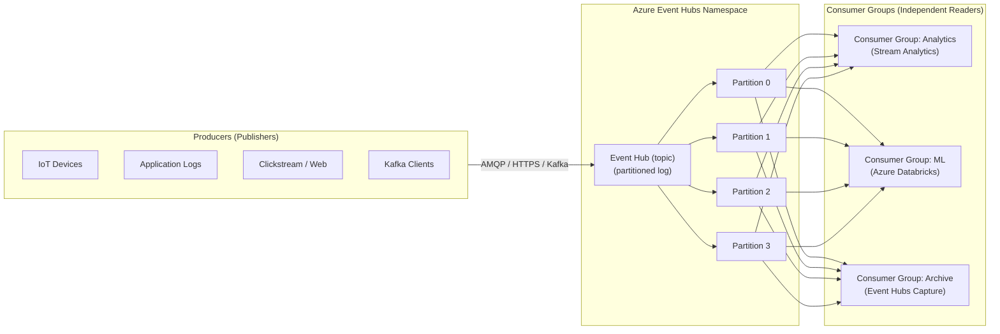

# 🌊 Azure Event Hubs
{: .no_toc }

**Hyper-scale event streaming platform — ingest millions of events per second with replay**
{: .fs-5 .fw-300 }

---

## Table of Contents
{: .no_toc .text-delta }

1. TOC
{:toc}

---

## Product Overview

Azure Event Hubs is a **big-data streaming platform and event ingestion service**. It can receive and process millions of events per second with low latency. Event Hubs is designed for **telemetry ingestion, log streaming, clickstream data, IoT data pipelines, and any scenario requiring high-throughput, ordered, replayable event streams**.

Event Hubs is Azure's **Apache Kafka-compatible** streaming service. Kafka clients can connect to Event Hubs without code changes.

---

## Core Concepts

### Event Hub (Topic)
An **Event Hub** is a named stream inside a namespace — analogous to a Kafka topic. Events are appended to a **partitioned, time-ordered log**.

### Partitions
Partitions are the unit of parallelism in Event Hubs. Each partition is an independent, ordered sequence of events. Key properties:

| Property | Detail |
|----------|--------|
| Default partitions | 4 (Standard/Premium) |
| Max partitions | 32 (Standard) / **2,000** (Premium / Dedicated) |
| Partition count | **Set at creation; cannot be changed** |
| Ordering guarantee | Guaranteed **within a partition** |
| Partition routing | By partition key (hash) or round-robin |

> ⚠️ **Exam Caveat:** Partition count is **immutable after creation**. If a scenario requires more partitions later, a new Event Hub must be created. Plan capacity upfront.

### Consumer Groups
A consumer group is an independent view of the entire stream — each consumer group maintains its own **offset** (position in the stream). This enables multiple independent consumers to read the same data at their own pace without interfering with each other.

| Consumer Groups | Limit |
|-----------------|-------|
| Basic | 1 consumer group |
| Standard | Up to **20** consumer groups |
| Premium | Up to **100** consumer groups |

### Offset & Replay
Unlike queues, Event Hubs retains events for a configurable **retention period**. Consumers can reset their offset to any point within the retention window and **replay events** — a key differentiator from Service Bus.

| Property | Detail |
|----------|--------|
| Default retention | **1 day** |
| Max retention (Standard) | **7 days** |
| Max retention (Premium) | **90 days** |
| Max retention (Dedicated) | **90 days** |

> ⚠️ **Exam Caveat:** The ability to **replay events** is unique to Event Hubs among the four messaging services. If a scenario mentions replaying events for reprocessing or recovery, the answer is **Event Hubs**.

---

## Capacity Model

### Standard & Premium: Throughput Units / Processing Units

| SKU | Capacity Unit | Ingress | Egress |
|-----|--------------|---------|--------|
| **Standard** | Throughput Unit (TU) | 1 MB/s or 1,000 events/s per TU | 2 MB/s per TU |
| **Premium** | Processing Unit (PU) | ~1 GB/s per PU (much higher) | Proportional |
| **Dedicated** | Capacity Unit (CU) | ~1 GB/s per CU | Proportional |

**Standard limits:**
- Max 40 TUs per namespace (soft limit; can be raised)
- Auto-inflate: ✅ Automatically scales TUs up to a configured max

**Premium limits:**
- 1–16 PUs per namespace
- Fixed price per PU regardless of usage volume

> ⚠️ **Exam Caveat:** Standard TUs cap at **20 MB/s ingress** (20 TUs). For higher throughput, use **Premium** or **Dedicated**. Auto-inflate is only available on Standard.

---

## SKU Tiers

| Feature | Basic | Standard | Premium | Dedicated |
|---------|-------|----------|---------|-----------|
| **Consumer groups** | 1 | 20 | 100 | Unlimited |
| **Brokered connections** | 100 | 1,000 | 10,000 | Unlimited |
| **Retention** | 1 day | 1–7 days | 1–90 days | 1–90 days |
| **Capture** | ❌ | ✅ | ✅ | ✅ |
| **Kafka surface** | ❌ | ✅ | ✅ | ✅ |
| **Schema Registry** | ❌ | ✅ | ✅ | ✅ |
| **VNet / Private Endpoint** | ❌ | ❌ | ✅ | ✅ |
| **Geo-DR** | ❌ | ✅ | ✅ | ✅ |
| **Availability Zones** | ❌ | ✅ (auto) | ✅ (auto) | ✅ |
| **Customer-managed keys** | ❌ | ❌ | ✅ | ✅ |
| **Max partitions** | 32 | 32 | 100 | 2,000 |
| **Dedicated cluster** | ❌ | ❌ | ❌ | ✅ |
| **Pricing** | Per TU | Per TU | Per PU | Per CU (hourly) |

---

## SLA

| SKU | Uptime SLA |
|-----|-----------|
| Basic | **99.9%** |
| Standard | **99.9%** |
| Premium | **99.95%** |
| Dedicated | **99.99%** |

> ⚠️ **Exam Caveat:** Event Hubs Dedicated is the only tier with a **99.99% SLA** — achieved through Availability Zone support in its isolated single-tenant cluster.

---

## Event Hubs Capture

Capture automatically delivers the streaming data to **Azure Blob Storage** or **Azure Data Lake Storage Gen2** in **Avro or Parquet format** — without writing any consumer code. This is the primary way to persist event streams for long-term analytics.

| Property | Detail |
|----------|--------|
| Output format | **Apache Avro** (default) or **Parquet** |
| Destination | Azure Blob Storage or ADLS Gen2 |
| Trigger | Time window (min 1 min) or size window (min 10 MB) |
| Availability | Standard, Premium, Dedicated (NOT Basic) |
| Cost | Charged per Capture-hour plus storage costs |

> ⚠️ **Exam Caveat:** Event Hubs Capture requires **Standard tier or above** — it is not available on Basic.

---

## Kafka Compatibility

Event Hubs exposes a **Kafka endpoint** on port 9093 (TLS). Kafka clients can produce and consume events without code changes — only the connection string is different. This makes Event Hubs a managed replacement for self-hosted Kafka clusters.

| Kafka Concept | Event Hubs Equivalent |
|--------------|----------------------|
| Broker | Event Hubs Namespace |
| Topic | Event Hub |
| Partition | Partition |
| Consumer Group | Consumer Group |
| Offset | Offset |

> ⚠️ **Exam Caveat:** Kafka surface is available from **Standard tier and above** — not Basic.

---

## Geo-Disaster Recovery

Event Hubs Geo-DR pairs a **primary** and **secondary** namespace. Like Service Bus Geo-DR, it replicates **metadata only** (Event Hub definitions, consumer groups) — not messages in flight. On failover, the secondary becomes the active namespace via an alias FQDN.

**Active Geo-Replication** (message-level): Must be implemented at the **application layer** using dual-write producers.

---

## Schema Registry

Event Hubs includes a built-in **Schema Registry** (Standard and above) for managing and enforcing Avro, JSON Schema, or Protobuf schemas on event producers and consumers. This enables schema evolution without breaking consumers.

---

## Security

| Mechanism | Notes |
|-----------|-------|
| **SAS tokens** | Namespace or entity-level; `Send`, `Listen`, `Manage` claims |
| **Microsoft Entra ID (RBAC)** | Preferred; assign `Azure Event Hubs Data Sender/Receiver` roles |
| **Managed Identity** | Allows producers/consumers to authenticate without secrets |
| **Private Endpoints** | Premium and Dedicated only |
| **Customer-managed keys** | Premium and Dedicated only |
| **IP filtering** | Available on all tiers |

---

## Common Exam Scenarios

| Scenario | Answer |
|----------|--------|
| Ingest 1 million IoT events/second | **Event Hubs** (Premium or Dedicated) |
| Replay events after a consumer bug | **Event Hubs** (unique to this service) |
| Stream telemetry into Azure Stream Analytics | **Event Hubs** as the input source |
| Replace self-managed Kafka cluster | **Event Hubs** (Kafka-compatible endpoint, Standard+) |
| Archive streaming data to ADLS Gen2 | **Event Hubs Capture** |
| Need > 7-day event retention | **Event Hubs Premium or Dedicated** (up to 90 days) |
| Isolate Event Hubs from public internet | **Event Hubs Premium + Private Endpoint** |
| Multiple independent analytics pipelines on same stream | **Event Hubs Consumer Groups** |
| Guaranteed event ordering across all partitions | NOT possible in Event Hubs — ordering is per-partition only |

---

[← 03 — Azure Event Grid](/az-305-messaging/03-event-grid/) | [05 — Feature Comparison →](/az-305-messaging/05-feature-comparison/)