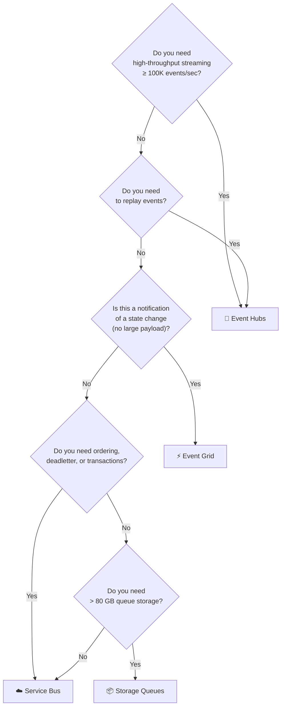

# 📊 Feature Comparison — All Four Services
{: .no_toc }

**The definitive side-by-side reference for AZ-305 scenario questions**
{: .fs-5 .fw-300 }

---

## Table of Contents
{: .no_toc .text-delta }

1. TOC
{:toc}

---

## The Big Picture — When to Use Which

---

## Master Comparison Table

| Feature | ☁️ Service Bus | 📦 Storage Queues | ⚡ Event Grid | 🌊 Event Hubs |
|---------|-------------|-----------------|-------------|-------------|
| **Primary pattern** | Message queue / pub-sub | Simple queue | Event routing | Event streaming |
| **Message / event size** | 256 KB (Std) / **100 MB** (Premium) | **64 KB** | **1 MB** | **1 MB** (default) / **~1 MB** max |
| **Max queue / topic size** | 80 GB | **500 TB** | N/A (push) | N/A (log-based) |
| **Throughput** | Moderate | Moderate | Up to 10M events/sec | **Millions/sec** |
| **Ordering** | FIFO with **Sessions** | Best-effort | Not guaranteed | Per-partition only |
| **At-least-once delivery** | ✅ | ✅ | ✅ | ✅ |
| **Exactly-once delivery** | ✅ (peek-lock + settle) | ❌ | ❌ | ❌ |
| **Dead-letter queue** | ✅ Built-in | ❌ (manual) | ✅ (to Blob) | ❌ |
| **Message replay** | ❌ | ❌ | ❌ | ✅ |
| **Retention** | TTL configurable (≤7 days default) | TTL ≤7 days | 24 hours retry window | 1–**90 days** |
| **Transactions** | ✅ (within namespace) | ❌ | ❌ | ❌ |
| **Pub/Sub (fan-out)** | ✅ (Topics) | ❌ | ✅ | ✅ (consumer groups) |
| **Duplicate detection** | ✅ | ❌ | ❌ | ❌ |
| **Sessions (FIFO groups)** | ✅ | ❌ | ❌ | ❌ |
| **Kafka compatibility** | ❌ | ❌ | ❌ | ✅ |
| **Built-in archive** | ❌ | ❌ | ❌ | ✅ (Capture → Blob/ADLS) |
| **Private Endpoints** | ✅ (Premium) | ✅ | ✅ (Namespace) | ✅ (Premium) |
| **VNet integration** | ✅ (Premium) | ✅ (Storage FW) | ✅ (Namespace) | ✅ (Premium) |
| **Geo-DR** | ✅ (Premium) | ✅ (GRS/RA-GRS) | ✅ (built-in) | ✅ (Std+) |
| **Availability Zones** | ✅ (Premium) | ✅ (ZRS option) | ✅ (built-in) | ✅ (Std+) |
| **SLA** | 99.9% / **99.99%** (Premium+AZ) | 99.9% / **99.99%** (RA-GRS read) | **99.99%** | 99.9% / **99.99%** (Dedicated) |
| **Pricing model** | Per operation / Per MU | Per operation | Per operation (per million) | Per TU / PU / CU |
| **Relative cost** | Medium | **Lowest** | Low | Medium–High |

---

## Queues: Service Bus vs Storage Queues
{: #queues-service-bus-vs-storage-queues }

Use this table when a scenario describes a **queue-based** decoupling need:

| Decision Factor | Choose Service Bus | Choose Storage Queues |
|----------------|-------------------|----------------------|
| Message ordering (FIFO) required | ✅ (Sessions) | ❌ |
| Dead-letter queue needed | ✅ | ❌ |
| Duplicate detection needed | ✅ | ❌ |
| Transactions across queue operations | ✅ | ❌ |
| Message > 64 KB | ✅ | ❌ |
| Fan-out (pub/sub) needed | ✅ (Topics) | ❌ |
| Long polling beyond 20s | ✅ | ❌ (max 20s) |
| Queue > 80 GB | ❌ | ✅ |
| Lowest cost acceptable | ❌ | ✅ |
| REST-only consumer (legacy) | ✅ | ✅ |
| Audit log of all queue operations | Limited | ✅ (Storage analytics) |

---

## Events: Event Grid vs Event Hubs
{: #events-event-grid-vs-event-hubs }

Use this table when a scenario describes an **event-driven** or **streaming** need:

| Decision Factor | Choose Event Grid | Choose Event Hubs |
|----------------|------------------|------------------|
| Reacting to Azure resource changes | ✅ | ❌ |
| Low-volume discrete events (notifications) | ✅ | Overkill |
| High-throughput stream (>1M events/sec) | ❌ | ✅ |
| Replay events after failure | ❌ | ✅ |
| Long-term retention (>24h) | ❌ | ✅ (up to 90 days) |
| Multiple independent stream readers | ✅ (subscriptions) | ✅ (consumer groups) |
| Kafka-compatible producers | ❌ | ✅ |
| Archive stream to ADLS Gen2 | ❌ | ✅ (Capture) |
| IoT telemetry ingestion at scale | ❌ | ✅ |
| Trigger serverless function on state change | ✅ | ✅ (both work, EG simpler) |

---

## SLA Comparison

| Service | Tier | SLA |
|---------|------|-----|
| Service Bus | Basic / Standard | 99.9% |
| Service Bus | Premium + Availability Zones | **99.99%** |
| Storage Queues | Standard (LRS/GRS) | 99.9% |
| Storage Queues | Standard (RA-GRS, read) | **99.99%** read |
| Event Grid | All (Custom / System Topics) | **99.99%** |
| Event Hubs | Basic / Standard | 99.9% |
| Event Hubs | Premium | 99.95% |
| Event Hubs | Dedicated | **99.99%** |

> ⚠️ **Exam Caveat:** Event Grid has the **highest baseline SLA (99.99%)** of the four services at no premium tier cost. Service Bus and Event Hubs require the top-tier SKU to reach 99.99%.

---

## Message / Event Size Limits

| Service | Max Size |
|---------|---------|
| Storage Queues | **64 KB** ← smallest |
| Event Grid | **1 MB** |
| Event Hubs | **1 MB** (default; configurable up to ~1 MB in Standard) |
| Service Bus Standard | **256 KB** |
| Service Bus Premium | **100 MB** ← largest |

> ⚠️ **Exam Caveat — Classic Trap:** If a scenario says *"messages up to 1 MB"*, both Event Grid and Event Hubs support this, but they serve entirely different patterns. If the scenario says *"messages up to 50 MB"*, only **Service Bus Premium** qualifies.

---

## Retention / Replay

| Service | Retention | Replay? |
|---------|-----------|---------|
| Storage Queues | TTL ≤ 7 days (messages deleted on dequeue) | ❌ |
| Service Bus | TTL configurable (messages deleted on settlement) | ❌ |
| Event Grid | 24-hour retry window only | ❌ |
| Event Hubs | 1–90 days (log-based, not deleted on read) | ✅ |

---

## Private Networking & Isolation

| Service | Private Endpoint | VNet Service Endpoint | IP Firewall |
|---------|-----------------|----------------------|-------------|
| Service Bus | ✅ Premium | ✅ Premium | ✅ All tiers |
| Storage Queues | ✅ All tiers | ✅ All tiers | ✅ All tiers |
| Event Grid | ✅ Namespace (Std/Prem) | ❌ | ✅ All tiers |
| Event Hubs | ✅ Premium/Dedicated | ✅ Premium/Dedicated | ✅ All tiers |

> ⚠️ **Exam Caveat:** Storage Queues have private endpoint support on **all tiers** (it's a Storage account feature). Service Bus, Event Grid (namespace), and Event Hubs require a **premium/dedicated tier** for private endpoint support.

---

## Geo-Redundancy & Disaster Recovery

| Service | Built-in Geo-Redundancy | Active-Active | Notes |
|---------|------------------------|---------------|-------|
| Storage Queues | ✅ GRS/RA-GRS | ❌ | Replicates queue data |
| Service Bus | ✅ Geo-DR (Premium) | ❌ (metadata only) | Messages NOT replicated |
| Event Grid | ✅ Built-in (all tiers) | ✅ Automatic | Fully managed |
| Event Hubs | ✅ Geo-DR (Std+) | ❌ (metadata only) | Messages NOT replicated |

> ⚠️ **Exam Caveat:** Event Grid is the **only service** where geo-redundancy is fully managed and automatic with no extra tier requirement. Service Bus and Event Hubs Geo-DR replicate **metadata only**, not in-flight messages.

---

## Authentication & RBAC Roles Quick Reference

| Service | Key Roles |
|---------|-----------|
| Service Bus | `Azure Service Bus Data Owner`, `Data Sender`, `Data Receiver` |
| Storage Queues | `Storage Queue Data Contributor`, `Message Sender`, `Message Processor` |
| Event Grid | `EventGrid Contributor`, `EventGrid Data Sender` |
| Event Hubs | `Azure Event Hubs Data Owner`, `Data Sender`, `Data Receiver` |
