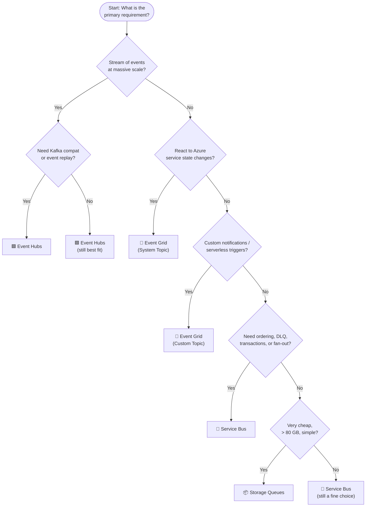

# 🎯 Exam Caveats & Quick-Reference Cheatsheet
{: .no_toc }

**Last-minute review — exam traps, decision trees, and must-memorise numbers**
{: .fs-5 .fw-300 }

---

## Table of Contents
{: .no_toc .text-delta }

1. TOC
{:toc}

---

## ⚠️ The Most Dangerous Exam Traps

These are the distractors and edge cases that most frequently appear in AZ-305 scenario questions. Know these cold.

### Trap 1 — "Ordering" does NOT mean Service Bus alone
> ❌ "Use a Service Bus queue for guaranteed ordering"  
> ✅ Guaranteed FIFO requires **Service Bus Queue + Sessions**

A plain Service Bus queue does not guarantee FIFO. Sessions are the enabling feature. If the exam omits Sessions in an "ordering required" scenario, Service Bus without Sessions is a wrong answer.

---

### Trap 2 — Dead-letter queue is NOT a Storage Queue feature
> ❌ "Use Storage Queues — they have built-in dead-lettering"  
> ✅ Storage Queues have **no built-in DLQ**

Dead-lettering must be implemented manually in application code (e.g., move to a separate queue after N failed attempts). The Azure Functions runtime does this for you via the `{queuename}-poison` queue, but that is an SDK behaviour, not a platform feature.

---

### Trap 3 — Service Bus Topics require Standard or Premium
> ❌ "Configure a Service Bus Basic namespace with topics"  
> ✅ Topics and Subscriptions require **Standard or Premium**

Basic SKU only supports **queues**. If the scenario mentions pub/sub or fan-out, the answer cannot be Service Bus Basic.

---

### Trap 4 — Event Grid is for events, not large messages
> ❌ "Use Event Grid to transfer 5 MB order payloads to consumers"  
> ✅ Event Grid has a **1 MB max event size** — it sends notifications, not large data payloads

For large payloads, use **Claim-Check pattern**: store the payload in Blob storage, send a reference event via Event Grid, consumer fetches payload directly.

---

### Trap 5 — Event Hubs is the only service with replay
> ❌ "Use Service Bus to replay messages after a processing bug"  
> ✅ Only **Event Hubs** supports consumer offset reset and event replay

Service Bus messages are deleted once settled. Event Hubs retains the log for 1–90 days and consumers can rewind their offset.

---

### Trap 6 — Geo-DR replicates metadata, not messages
> ❌ "Service Bus Geo-DR ensures no messages are lost during regional failure"  
> ✅ Service Bus and Event Hubs Geo-DR replicate **metadata only** (entity definitions)

Messages in flight on the primary are **not** replicated. For zero message loss during regional failover, implement application-level active replication (dual-write to two namespaces).

---

### Trap 7 — Partition count is immutable in Event Hubs
> ❌ "After launch we can increase partitions if throughput grows"  
> ✅ Event Hubs partition count is **fixed at creation**

Plan partitions upfront based on expected parallelism. Increasing partitions requires creating a new Event Hub.

---

### Trap 8 — SLA 99.99% without Premium SKU is only Event Grid
> Service Bus: 99.99% requires **Premium + Availability Zones**  
> Event Hubs: 99.99% requires **Dedicated cluster**  
> Storage Queues: 99.99% read-only via **RA-GRS** (not write)  
> Event Grid: **99.99% on all tiers** — no Premium required

---

### Trap 9 — Private Endpoints for Storage Queues don't require premium
> ❌ "Private endpoints for Storage Queues require a Premium storage tier"  
> ✅ Private endpoints on Azure Storage (including queues) are available on **all storage tiers**

Service Bus, Event Hubs, and Event Grid namespace require a Premium/Dedicated tier for private endpoints. Storage is different.

---

### Trap 10 — Event Hubs Capture is NOT available on Basic
> ❌ "Use Event Hubs Basic with Capture to archive the stream"  
> ✅ Capture requires **Standard, Premium, or Dedicated**

Basic Event Hubs supports only 1 consumer group and 1-day retention with no Capture feature.

---

### Trap 11 — Transactions in Service Bus are namespace-scoped
> ❌ "Use Service Bus transactions to atomically write to two namespaces"  
> ✅ Transactions work only **within a single namespace**

Cross-namespace atomic operations require saga patterns or compensating transactions at the application level.

---

### Trap 12 — Storage Queue message TTL can be set to infinite (`-1`)
> A TTL of `-1` on a Storage Queue message means it **never expires**. Most candidates assume 7 days is the hard maximum, but infinite TTL is valid.

---

## 📋 Must-Memorise Numbers

### Message & Event Size Limits

| Service | Max Size | Memory Hook |
|---------|---------|-------------|
| Storage Queues | **64 KB** | "Sixty-four is tiny" |
| Event Grid | **1 MB** | "Grid = grid paper = small" |
| Event Hubs | **1 MB** | "Same as Grid" |
| Service Bus Standard | **256 KB** | "Four times Storage Queue" |
| Service Bus Premium | **100 MB** | "One hundred — largest" |

### Retention Periods

| Service | Retention |
|---------|-----------|
| Storage Queues | ≤ 7 days (or infinite with `-1`) |
| Service Bus | Configurable; default 14 days |
| Event Grid | 24-hour retry window |
| Event Hubs Standard | **1–7 days** |
| Event Hubs Premium/Dedicated | **1–90 days** |

### SLA Values

| Service / Tier | SLA |
|---------------|-----|
| Service Bus Basic / Standard | **99.9%** |
| Service Bus Premium + AZ | **99.99%** |
| Storage Queues LRS/GRS | **99.9%** |
| Storage Queues RA-GRS (read) | **99.99%** |
| Event Grid (all tiers) | **99.99%** |
| Event Hubs Basic / Standard | **99.9%** |
| Event Hubs Premium | **99.95%** |
| Event Hubs Dedicated | **99.99%** |

### Consumer Limits

| Service | Consumer Groups / Subscriptions |
|---------|--------------------------------|
| Service Bus | Up to **2,000 subscriptions** per topic |
| Event Hubs Basic | **1** consumer group |
| Event Hubs Standard | **20** consumer groups |
| Event Hubs Premium | **100** consumer groups |

### Partition Limits

| Service | Max Partitions |
|---------|---------------|
| Event Hubs Standard | **32** |
| Event Hubs Premium | **100** |
| Event Hubs Dedicated | **2,000** |

---

## ⚡ Decision Tree — Choosing the Right Service

---

## 🃏 Flash Card — One-Line Definitions

| Service | One-Line Definition |
|---------|-------------------|
| **Service Bus** | Enterprise message broker: guaranteed delivery, ordering (Sessions), transactions, pub/sub |
| **Storage Queues** | Cheap, simple, massive-scale queue built on Storage; no DLQ, no ordering, no transactions |
| **Event Grid** | Serverless event **router**: react to state changes across Azure services; 99.99% SLA by default |
| **Event Hubs** | High-throughput event **stream**: ingest millions/sec, replay from offset, Kafka-compatible |

---

## 🔑 Feature Lock-In Summary

| If the exam says… | The answer is… |
|------------------|---------------|
| Guaranteed FIFO ordering | Service Bus + **Sessions** |
| Dead-letter failed messages | **Service Bus** |
| Replay events after failure | **Event Hubs** |
| Millions of events per second | **Event Hubs** |
| Archive stream to Data Lake | **Event Hubs Capture** |
| Kafka without code changes | **Event Hubs** |
| React to BlobCreated / VM deleted | **Event Grid** |
| Fan-out to different backends | **Event Grid** or Service Bus Topics |
| Queue > 80 GB | **Storage Queues** |
| Lowest cost queue, no special features | **Storage Queues** |
| Private endpoint, no premium cost | **Storage Queues** (Storage account) |
| 99.99% SLA, no premium fee | **Event Grid** |
| 99.99% SLA on Service Bus | Premium + **Availability Zones** |
| 99.99% SLA on Event Hubs | **Dedicated** |
| Atomic write across queues | **Service Bus Transactions** (same namespace) |
| Large messages > 256 KB | **Service Bus Premium** |
| > 90-day event retention | ❌ None natively — archive to Blob via Capture |

---

## ✅ Final Exam Checklist

Before sitting the exam, verify you can answer these without hesitation:

- [ ] What feature enables FIFO in Service Bus?
- [ ] What SKU tiers support Service Bus Topics?
- [ ] Which services support private endpoints without a premium tier?
- [ ] Which is the only service that supports event replay?
- [ ] What is the max message size in Storage Queues?
- [ ] What does Event Hubs Capture output to, and in what format?
- [ ] What does Service Bus Geo-DR replicate? What does it NOT replicate?
- [ ] Which service has 99.99% SLA on all tiers?
- [ ] Which Event Hubs tier supports Kafka?
- [ ] Can Event Hubs partition count be changed after creation?
- [ ] What is the max event size in Event Grid?
- [ ] What is the maximum retention period for Event Hubs?

---

[← 05 - Feature Comparison](/az-305-messaging/05-feature-comparison/) | [Back to Home →](/az-305-messaging/)